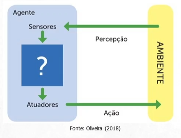
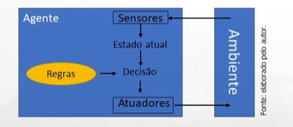
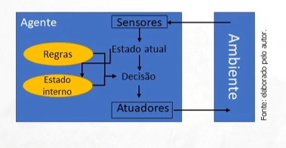

# O que é a Inteligência Artificial?

## O que é inteligência?
- capacidade de resolver problemas
- aprendizado com o ambiente
- desenvolvimento de estruturas cognitivas
- orientação a metas

## O que é Inteligência Artificial?
A programação de IA se baseia em três habilidades cognitivas:
- Aprendizado
- Raciocínio
- Autocorreção

## Tipos de IA
### IA fraca
- tarefas especificas
- aplicações de IA que nos cerca atualmente

### IA forte
- ia geral - máquina com inteligência igual a humanos
- super ia - máquinas mais inteligêntes que humanos

## Aplicações da IA
### Negócios:
- plataforma de análise e gerenciamento de relacionamento com o cliente
- chatbots
### Saúde:
- diagnóstico automático    
- atendimento clínico
- robôs autônomos 
    >foram utilizados na pandemia para distribuir medicamentos e prevenir que os médicos fossem contaminados
### Segurança:
- smart home
- cibersecurity
- gerenciamento de eventos e informações de segurança
### Manufatura
- robôs industriais multitarefas
### Direito
- Documentação
- Vasculha de informações
### Reconhecimento de padrões:
- reconhecimento facial
- reconhecimento de objetos em imagens
- reconhecimento de voz
- processametno de linguagem natural
- reconhecimento ótico de caracteres
- entre outros.

# Ia X ética

## Consciência Artificial
Um exemplo de IA forte, são máquinas com consciência artificial, que seria uma máquina criada pelo homem que seja ciente da sua própria existência

### Viés na IA
IA fornece resultados diferentes para um grupo de pessoas em comparação com outro, considerando:
- raça
- gênero
- nacionalidade, etc

Este problema pode vir de dados de treinamento não representativos ou incompletos e da dependência de informações falhas que refletem desigualdades históricas

# Agentes Inteligentes
Agentes são entidades capazes de **perceber** seu **ambiente**, tomar decisões e então **agir**.
Esses Agentes possuem **Sensores** e **Atuadores**, para perceber e interagir com o ambiente, respectivamente.!

## Um agente de IA precisa seguir quatro regras:
1. deve ter a capacidade de perceber o ambiente.
2. a percepção deve ser usada para tomar decisões
3. a decisão deve resultar em uma ação
4. a ação tomada por um agente de IA deve ser uma ação racional

## Os 5 tipos de Agentes Inteligentes
- agentes reativos simples
- agentes reativos baseados em modelo
- agentes baseados em objetivo
- agentes baseados em utilidade
- agentes de aprendizagem

### Agentes **reativos simples**
- age apenas com base na percepção atual
- ignora o histórico de percepção
- baseia-se na condição-ação
- aplicável para ambientes totalmente observáveis

### Agentes **reativos baseados em modelo**
- considera o histórico de percepção
- mantém um estado interno que se ajusta a cada percepção
- pode lidar com ambientes parcialmente observáveis

### Agentes **reativos baseados em objetivos**
- além das informações de estado interno, mantém também informações sobre metas ou situações desejadas
- todas as ações são tomadas visando reduzir a distância do seu objetivo
- o conhecimento e objetivo podem ser mudados

### Agentes **reativos baseados em utilidades**
- são usados quando existem várias alternativas possíveis
- escolhe ações com base em preferências

> Um exemplo deste agente sendo utilizado no mercado de logística é: escolher o caminho mais rápido, seguro e barato para chegar em um destino.

> A diferença entre o agente baseado em objetivos e o agente baseado em utilidades é a complexidade. O agente baseado em objetivos focaria somente em resolver um problema por vez, podemos supor que ele iria somente sugerir o caminho padrão para o destino, já o agente baseado em utilidades consideraria todo o contexto a qual ele foi apresentado.

### Agentes de **aprendizagem**
- inicia agindo com conhecimento básico e aperfeiçoa com o tempo
- empregam um elemento de aprendizagem que permite que aprendam com experiência
> machine learning

# Tecnologias na IA

## Reconhecimento de Padrões
**Padrões** podem ser entidades de interesse em um conjunto de dados

O **reconhecimento de padrões** na IA refere-se a habilidade de uma máquina identificar padrões em dados de entrada.
Para que uma máquina seja capaz de realizar o processo de reconhecimento de padrões é preciso:

1. representar os atributos ou características dos dados
2. aprender os conceitos das classes ou rótulos desses dados
3. armazenar o conhecimento aprendido
4. utilizar o conhecimento aprendido para reconhecer padrões em novos dados

### Aplicações no mundo real
- Reconhecimento facial
> Detecção de fraudes, usado em aeroportos e controles de fronteiras, serviços bancários, senhas
- Reconhecimento de caracteres manuscritos
- Reconhecimento de voz
> Capta o áudio e transforma em sinais digitais, interpreta as informações (siri, alexa, etc)
- Biometria
- Previsão de falhas
- Automação
> Permite que máquinas realizem tarefas manuais onerosas ou ineficientes ou que são suscetíveis a falhas humanas
- Entre outros.

### Ferramentas para IA
- Linguagens de programação: Pythin, C++, MATLAB, R, entre outros.
- Ferramentas: Microsoft Azure, AWS, IBM Watson e Google CGP
- Bibliotecas: OpenCV, TensorFlow, Pytorch